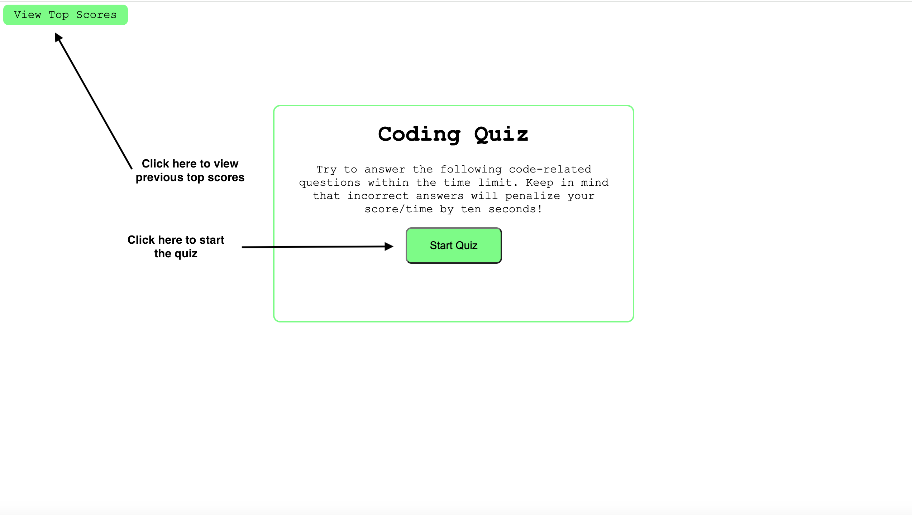
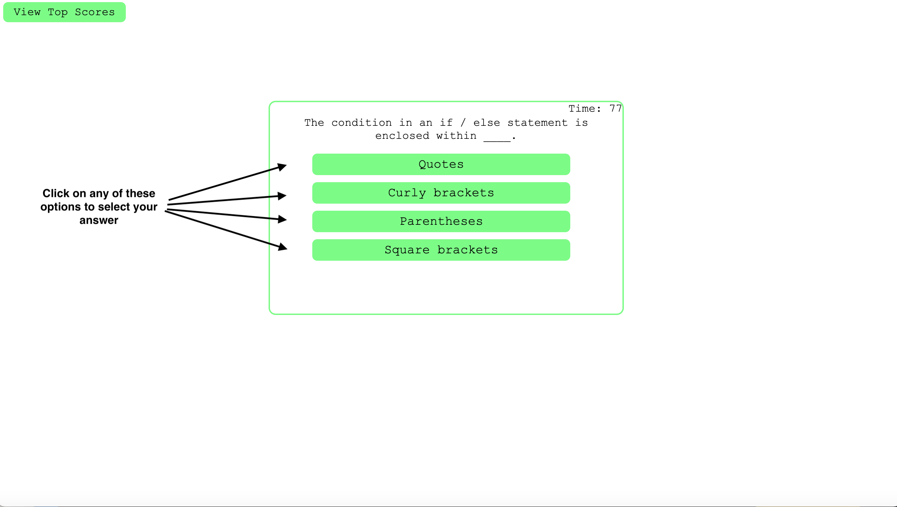
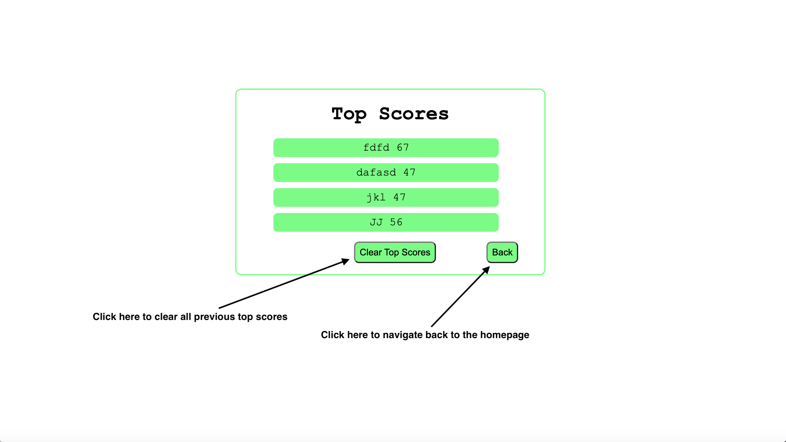

# Code-Quiz
Timed coding quiz with multiple choice question.

## Description
This app is a short coding quiz designed to help developers prepare for possible coding assesments they may face during interviews with prospective employers. 
It provides a series of questions with a timer which deducts 10 seconds whenever an incorrect answer is selected. 

## Usage

See images below for a guide on how to use this app. User clicks the start button to start the quiz. They then select an answer from the list below the question. Once all questions are answered, the user can enter their initials and submit their score to the top scores page. 

